<div align="center">
  <h1>🎓 EduBench-Local</h1>
  <p><strong>Evaluating Edge-Capable Small Language Models as Intelligent Educational Tutors</strong></p>
</div>

<hr>

## 📖 About the Project

The rapid advancement of Large Language Models (LLMs) has revolutionized AI tutoring. However, relying on massive, proprietary cloud models (like GPT-4) introduces severe privacy concerns for students, mandates persistent internet connectivity, and incurs massive recurring API costs for underfunded schools.

**EduBench-Local** is a fully open-source, edge-first evaluation framework. It is specifically designed to answer a critical research question: *Can we deploy intelligent, conversational AI tutors directly on severely constrained student hardware (e.g., consumer laptops with only 4GB VRAM)?*

By utilizing the Vulkan API and heavy quantization, this framework evaluates open-weight Small Language Models (SLMs) locally, guaranteeing 100% data privacy and zero recurring costs.

## 🚀 Key Features
* **100% Local Inference:** No cloud APIs. Built on Ollama running a Vulkan backend for AMD GPU compatibility.
* **Multi-Metric Evaluation:** Combines classical NLP metrics (ROUGE-L, BERTScore) with a novel **LLM-as-a-Judge** paradigm.
* **Educational Datasets:** Evaluated across 5 diverse educational domains (Reading Comprehension, Factual Science, and Logical Reasoning).
* **Automated Data Visualization:** A built-in Matplotlib/Seaborn pipeline that automatically generates 7 distinct statistical charts.

## 📂 Repository Structure

```text
📦 EduBench-Local
 ┣ 📂 data/                   # Raw and processed subsets of the educational datasets
 ┣ 📂 docs/                   # The static HTML/CSS/JS frontend for the web leaderboard
 ┃ ┗ 📂 assets/               # Generated visualization graphs
 ┣ 📂 external_evaluations/   # Contributor folders containing additional raw inference data
 ┣ 📂 research_materials/     # Project roadmaps, PDFs, and the formal Research Paper
 ┣ 📂 results/                # Core Mistral 7B generation outputs and metrics
 ┣ 📂 results_orca/           # Core Orca Mini 3B generation outputs and metrics
 ┣ 📂 scripts/                # Maintenance, UI refactoring, and data-fixing utilities
 ┣ 📂 src/                    # Core pipeline (metrics, parsers, and visualizers)
 ┣ 📜 config.py               # Global settings, prompt templates, and generation options
 ┣ 📜 run_pipeline.py         # Main execution script for Mistral 7B
 ┣ 📜 run_pipeline_orca.py    # Main execution script for Orca Mini 3B
 ┗ 📜 README.md
```

## 📊 Evaluation Datasets
We systematically sample questions from standardized educational datasets to test various cognitive loads:
1. **ARC-Challenge:** Grade-school science requiring logical deduction.
2. **OpenBookQA:** Science facts paired with common sense reasoning.
3. **SciQ:** Extractive factual recall from scientific passages.
4. **RACE (Middle):** Complex, multi-hop reading comprehension.
5. **SQuAD:** Extractive Question Answering from Wikipedia articles.

---

## 📈 Visualizations and Model Analytics

Our pipeline automatically generates comprehensive analytics for the models evaluated. Below is the comparative visual breakdown of **Mistral 7B** (a robust, dense foundation model) versus **Orca Mini 3B** (a heavily distilled, ultra-lightweight model).

### 🤖 Mistral 7B Analysis

Mistral 7B demonstrated exceptional instruction-following capabilities and deep factual knowledge, peaking with a mean LLM-Judge score of 4.52/5.

<details open>
<summary><b>Click to expand Mistral 7B Graphs</b></summary>

<br>

**1. Dataset Metric Averages**
> Compares the raw score of ROUGE, BERTScore, and Judge across all 5 datasets.
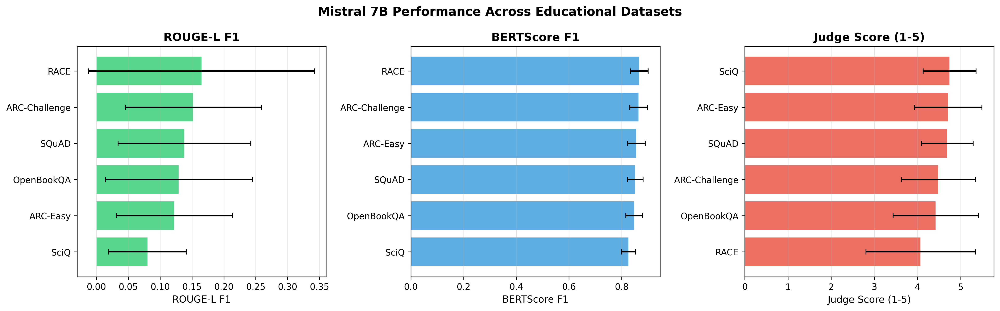

**2. Radar Chart (Subject Coverage)**
> Visualizes how balanced Mistral's knowledge base is across domains.
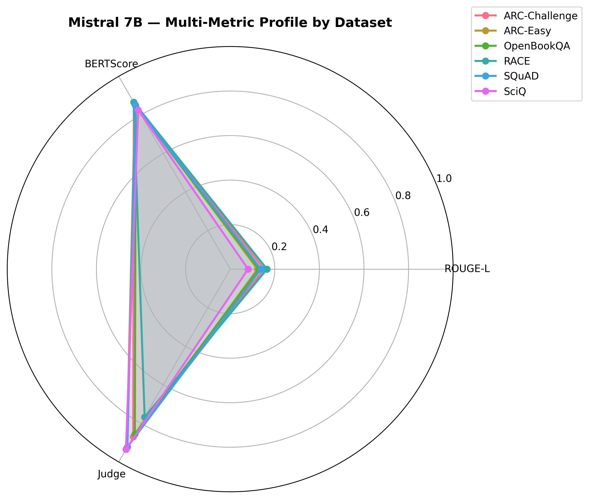

**3. Metric Correlation Heatmap**
> Shows the weak correlation between classical exact-match metrics and true factual correctness (Judge).
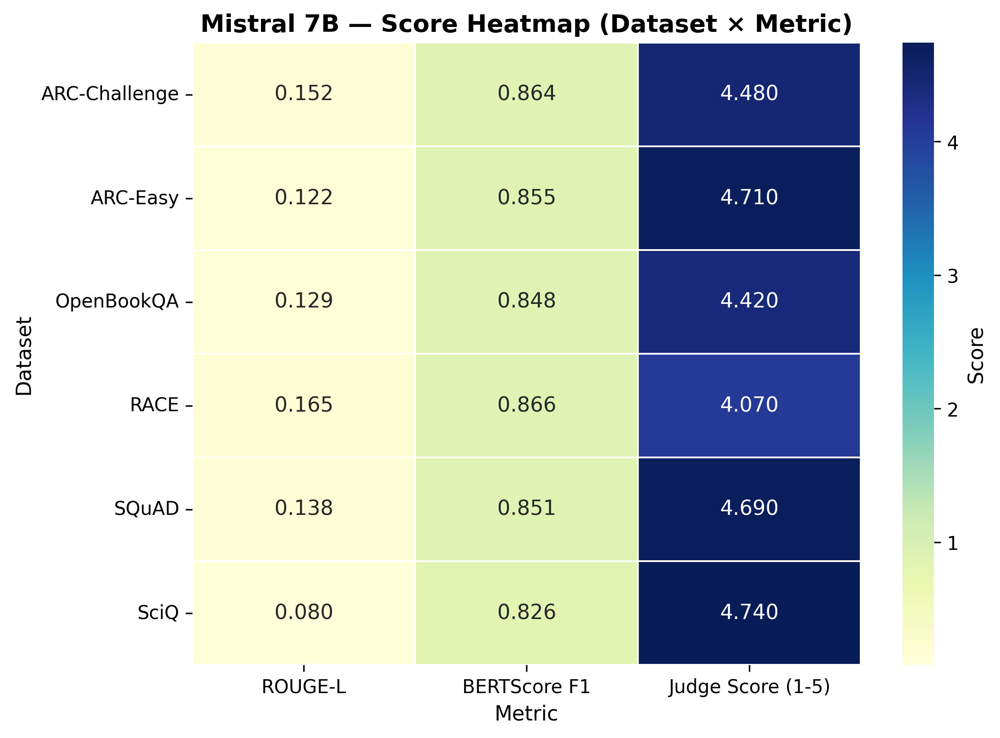

**4. Score Distributions (Box Plots)**
> Displays the variance and median distribution of the Judge scores.
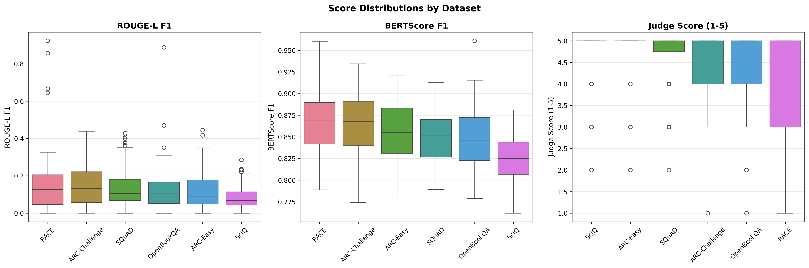

**5. BERTScore vs. Judge Alignment**
> A scatter plot proving that semantic similarity does not strictly guarantee logical factual correctness.
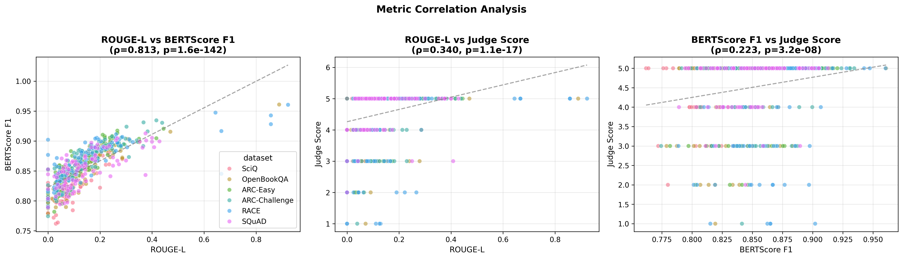

**6. Generation Latency Analysis**
> Shows the latency burden of running a 7B parameter model on a 4GB VRAM mobile GPU (~10s per generation).
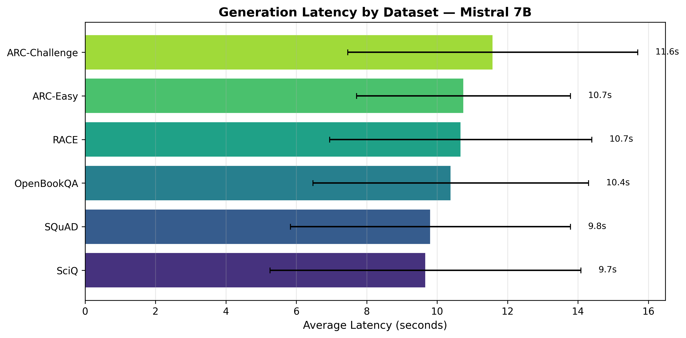

</details>

---

### 🧠 Orca Mini 3B Analysis

Orca Mini 3B, while incredibly fast, struggled significantly with complex instruction following, particularly on multiple-choice formatting.

<details open>
<summary><b>Click to expand Orca Mini 3B Graphs</b></summary>

<br>

**1. Dataset Metric Averages**
> Note the sharp drop-off in Judge scores compared to Mistral.
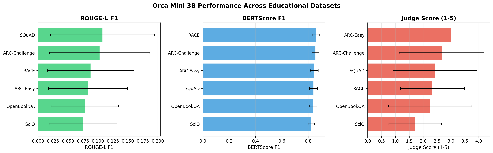

**2. Radar Chart (Subject Coverage)**
> Reveals distinct weaknesses in reasoning-heavy tasks.
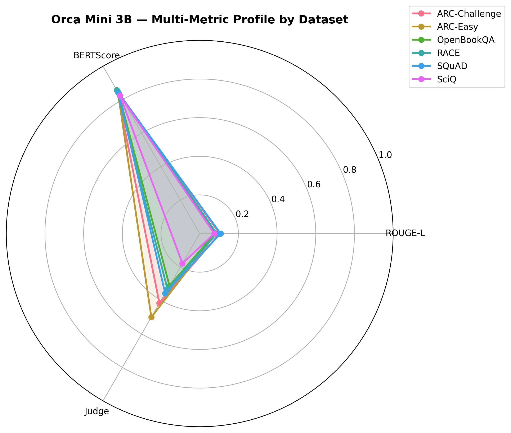

**3. Metric Correlation Heatmap**
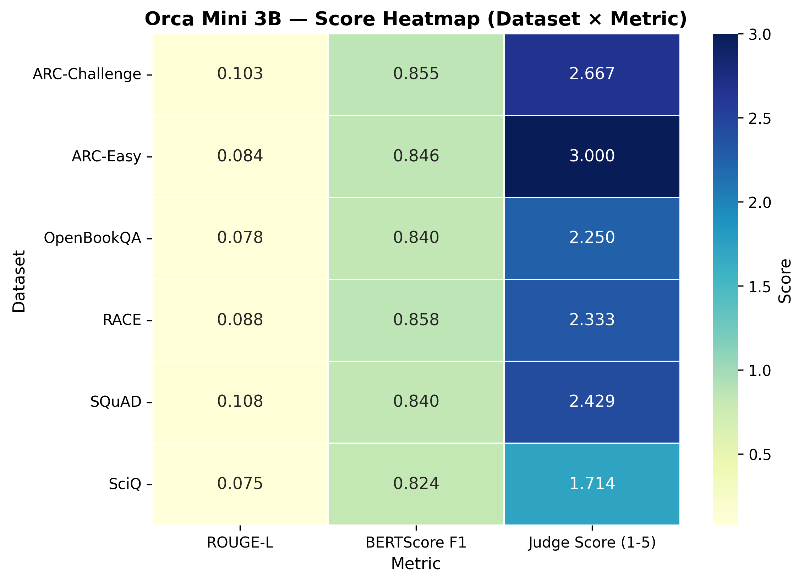

**4. Score Distributions (Box Plots)**
> Highlights the high variance and numerous catastrophic failures (1/5 scores).
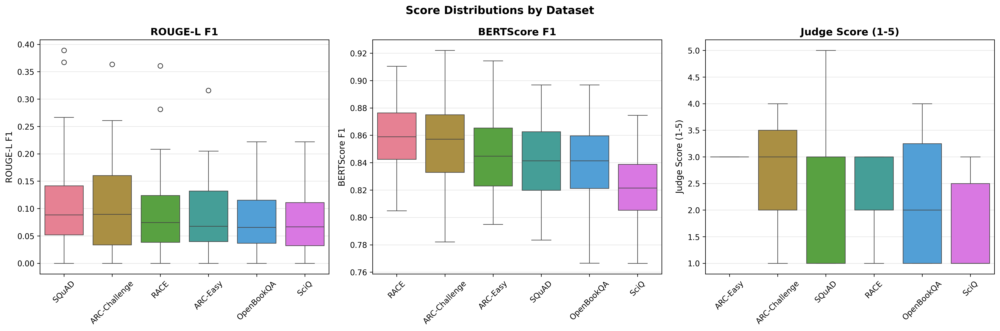

**5. BERTScore vs. Judge Alignment**
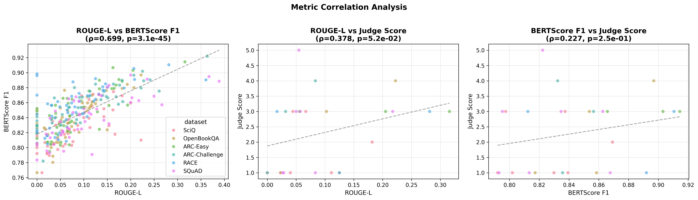

**6. Generation Latency Analysis**
> Shows the primary benefit of the 3B model: exceptional generation speeds (~3 seconds per query).
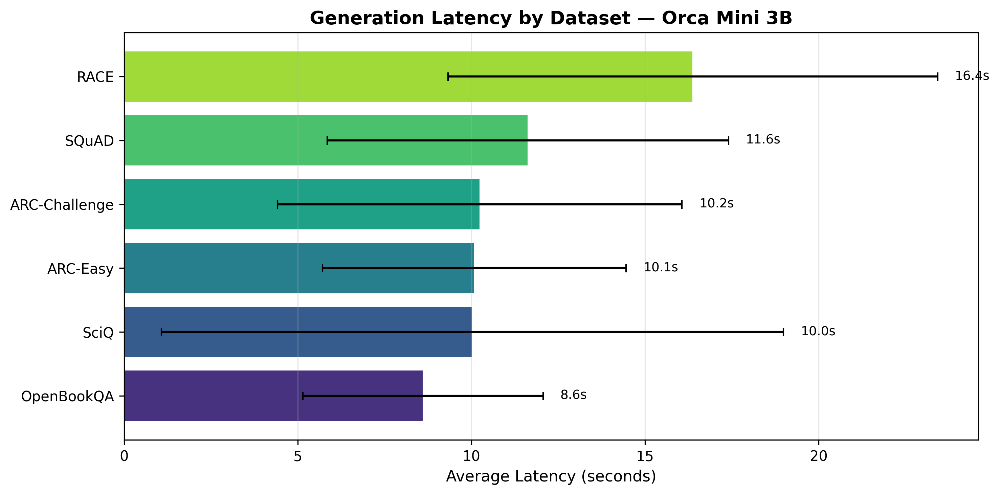

</details>

---

## 🛠️ Getting Started

### Prerequisites
* **Ollama**: Installed and running locally.
* **Hardware**: At least 4GB of VRAM (AMD or NVIDIA).
* **Python 3.10+**

### Installation
1. Clone the repository.
2. Install dependencies:
   ```bash
   pip install -r requirements.txt
   ```
3. Pull the required models via Ollama:
   ```bash
   ollama run mistral:7b
   ollama run orca-mini:3b
   ```

### Execution
Run the full inference, grading, and visualization pipeline for Mistral 7B:
```bash
python run_pipeline.py
```
To evaluate Orca Mini 3B:
```bash
python run_pipeline_orca.py
```

To view the generated web dashboard:
```bash
python -m http.server 8000
```
Then navigate to `http://localhost:8000/docs/index.html` in your browser.

---
**Maintained by**: Rishi and the EduBench Research Team.
