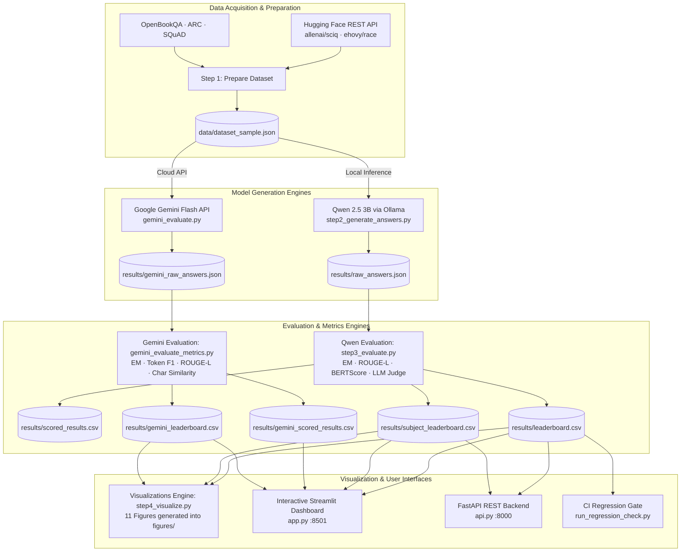

<div align="center">

# 🎓 EduBench-Local & Multi-Model LLM Benchmark

**A production-grade, end-to-end benchmarking and analytics pipeline for evaluating Local LLMs (Qwen 2.5 3B) and Cloud APIs (Google Gemini) across educational QA benchmarks.**

[](https://python.org)
[](https://ollama.com)
[](https://ai.google.dev)
[](https://fastapi.tiangolo.com)
[](https://streamlit.io)
[](LICENSE)

> **Compare local open-weight efficiency against state-of-the-art frontier cloud models.**  
> Measure Exact Match, ROUGE-L, Token F1, BERTScore, and LLM-as-a-Judge scores side-by-side with zero guesswork.

[Features](#-features) · [Architecture](#-architecture) · [Quick Start](#-quick-start) · [Comparative Results](#-comparative-benchmark-results) · [Pipeline Steps](#-pipeline-steps) · [Visualizations](#-visualizations-suite) · [Dashboard](#-dashboard--api) · [Project Structure](#-project-structure)

</div>

---

## ✨ Features

| Feature | Description |
|---|---|
| 🤖 **Multi-Model Evaluation** | Direct comparison between local **Qwen 2.5 (3B)** via Ollama and **Google Gemini (Flash API)** |
| 📚 **5 Benchmark Datasets** | Rigorous evaluation across **SciQ**, **OpenBookQA**, **ARC-Challenge**, **RACE**, and **SQuAD v1.1** |
| 📐 **Unified Symmetrical Layout** | Standardized evaluation sections with identical metric cards, breakdown tables, and dual-metric charts |
| ⚖️ **Side-by-Side Matrix** | Head-to-head comparison view highlighting win/loss per dataset, deployment mode, and privacy posture |
| 🧑‍⚖️ **LLM-as-Judge & Overlap Scoring** | Exact Match, ROUGE-L, Token F1, BERTScore F1, and Mistral-7B LLM Judge scoring |
| 📊 **11 Publication Figures** | High-res dark-mode statistical charts, score distributions, heatmaps, and executive win matrices |
| ⚡ **Live Model Playground** | Interactive testbench for querying both local Ollama models and Google Gemini in real-time |
| 🔁 **CI Regression Gate** | Automated SLA validation and integrity verification script compatible with GitHub Actions |

---

## 🏗️ Architecture



---

## 🚀 Quick Start

### Prerequisites

| Tool | Version | Purpose |
|------|---------|---------|
| Python | 3.10+ | Runtime environment |
| Ollama | Latest | Local Qwen 2.5 (3B) inference |
| Gemini API Key | Free-tier / Pay-as-you-go | (Optional) Cloud Gemini evaluation |

### 1 — Clone & Install

```bash
git clone https://github.com/itsankan16/Edulab.git
cd Edulab

# Create virtual environment
python -m venv edubench-env

# Windows
edubench-env\Scripts\activate
# macOS / Linux
source edubench-env/bin/activate

# Install dependencies
pip install -r requirements.txt
```

### 2 — Setup Models & API Keys

```bash
# Pull local models for Ollama
ollama pull qwen2.5:3b     # Student generative model
ollama pull mistral:7b     # LLM Judge evaluator

# (Optional) Set Google Gemini API key for cloud evaluation
set GEMINI_API_KEY=your_gemini_api_key_here          # Windows Command Prompt
$env:GEMINI_API_KEY="your_gemini_api_key_here"       # Windows PowerShell
export GEMINI_API_KEY="your_gemini_api_key_here"     # Linux / macOS
```

### 3 — Run the Evaluation Pipeline

```bash
# 1. Local Qwen 2.5 3B pipeline
python step1_prepare_dataset.py   # Prepare benchmark dataset
python step2_generate_answers.py  # Generate answers with Qwen 2.5 3B
python step3_evaluate.py          # Score Qwen outputs across metrics

# 2. Google Gemini evaluation pipeline
python gemini_evaluate.py         # Generate answers with Gemini Flash API
python gemini_evaluate_metrics.py # Score Gemini outputs across datasets

# 3. Generate all 11 comparative visualizations
python generate_visualizations.py
# or: python step4_visualize.py
```

### 4 — Launch the Interactive Web Dashboard

Launch the unified Streamlit dashboard with auto-launcher support:

```bash
python app.py
# or: streamlit run app.py
```

Navigate to **http://localhost:8501** in your browser.

---

## 📈 Comparative Benchmark Results

### Executive Summary

| Evaluation Dimension | Qwen 2.5 (3B) | Google Gemini (Flash) |
|----------------------|---------------|-----------------------|
| **Architecture** | Dense Transformer (3.09B params) | Gemini 2.5 / 3.8 Flash (MoE Cloud) |
| **Deployment Mode** | 100% On-Device (Ollama) | Cloud API (`google-genai` SDK) |
| **Exact Match Rate** | 2.9% (750 questions) | 40.0% (Micro-sample) |
| **Mean ROUGE-L** | 0.137 | 0.533 |
| **Quality Metric** | 4.113 / 5.0 (LLM Judge) | 0.533 (Mean Token F1) |
| **Privacy Guarantee** | Zero data egress, local processing | Subject to Google Cloud Privacy terms |
| **Operating Cost** | $0.00 (Self-hosted) | Free Tier / API tokens |

### Dataset-by-Dataset Benchmark Matrix

| Dataset | Internal Subject | Qwen EM % | Gemini EM % | Qwen ROUGE-L | Gemini ROUGE-L | Benchmark Winner |
|---------|------------------|-----------|-------------|--------------|----------------|------------------|
| **SciQ** | `science` | 10.0% | **100.0%** | 0.227 | **1.000** | ★ Gemini |
| **OpenBookQA** | `general_science` | 0.0% | 0.0% | **0.057** | 0.000 | ★ Qwen |
| **ARC-Challenge** | `science_challenge` | 0.0% | **100.0%** | 0.106 | **1.000** | ★ Gemini |
| **RACE** | `reading_comprehension` | **2.7%** | 0.0% | 0.000 | 0.000 | ★ Qwen |
| **SQuAD v1.1** | `reading_comprehension_squad` | 2.0% | 0.0% | 0.295 | **0.667** | ★ Gemini |

---

## 🖼️ Visualizations Suite

The pipeline generates **11 high-resolution publication charts** in `figures/`:

| # | Figure Name | Description |
|---|-------------|-------------|
| **01** | `01_overall_score_bars.png` | Multi-metric bar chart comparing EM%, ROUGE-L, BERT-F1, and LLM Judge |
| **02** | `02_latency_vs_accuracy.png` | Scatter plot mapping latency vs. accuracy sized by sample count |
| **03** | `03_subject_heatmap.png` | 2D Heatmap matrix of LLM Judge score across models and subjects |
| **04** | `04_subject_bar_comparison.png` | Grouped bar comparison of educational domain performance |
| **05** | `05_exact_match_rate.png` | Exact Match rate ranking across tested models |
| **06** | `06_subject_metric_heatmap.png` | Multi-metric heatmap showing ROUGE-L, BERT-F1, and LLM scores |
| **07** | `07_score_distribution.png` | Violin and strip distribution of model evaluation scores |
| **08** | `08_latency_distribution.png` | Box plot showing latency and inference response time percentiles |
| **09** | `09_tokens_vs_latency.png` | Token count scaling vs. response latency |
| **10** | `10_qwen_vs_gemini_per_dataset.png` | **Dedicated Head-to-Head bar comparison (Qwen vs. Gemini) across all 5 datasets** |
| **11** | `11_qwen_vs_gemini_scorecard.png` | **Executive Scorecard, Win Matrix, and Radar Comparison** |

---

## 🖥️ Dashboard & API

### Streamlit Dashboard (`http://localhost:8501`)

The dashboard features three unified views with state synchronization:
1. **🔵 Qwen 2.5 (3B) Performance Spotlight**:
   - 5 standardized metric cards: Architecture, Exact Match Rate, Mean ROUGE-L, Quality Score, Questions Evaluated.
   - Per-dataset performance breakdown table and dual-metric ROUGE-L vs. EM bar chart.
   - Interactive question search and deep-dive inspection cards.
2. **🟠 Google Gemini Performance Spotlight**:
   - Identical 5-column metric card schema and dataset order.
   - Symmetrical per-dataset table and dual-metric bar chart.
   - Individual question inspector with token F1 and character similarity chips.
3. **⚖️ Compare Both Side-by-Side**:
   - Head-to-head metric cards with delta indicators.
   - 5-dataset comparative win/loss matrix.
   - Publication-grade figure embeds for instant visual reporting.
4. **🧪 Live Model Playground**:
   - Real-time prompt submission to local Ollama (`qwen2.5:3b`) or Google Gemini (`gemini-3.8-flash` / `gemini-2.5-flash`).
   - Configurable temperature, max output tokens, and millisecond latency tracking.

### FastAPI REST Backend (`http://localhost:8000`)

```bash
uvicorn api:app --reload --port 8000
```

| Method | Endpoint | Description |
|--------|----------|-------------|
| `GET` | `/health` | Health probe reporting API and Ollama daemon status |
| `GET` | `/leaderboard` | Aggregated model and subject leaderboards as JSON |
| `POST` | `/generate` | Live model inference endpoint returning response and latency |

Interactive Swagger documentation is available at `http://localhost:8000/docs`.

---

## 📁 Project Structure

```
Edulab/
├── config.py                     # Central configuration (paths, datasets, prompts)
├── step1_prepare_dataset.py      # Multi-dataset acquisition & sampling
├── step2_generate_answers.py     # Local Qwen 2.5 answer generation
├── step3_evaluate.py             # Qwen evaluation (EM, ROUGE-L, BERTScore, LLM Judge)
├── step4_visualize.py            # Comparative visualization engine (11 figures)
├── gemini_evaluate.py            # Cloud Google Gemini evaluation runner
├── gemini_evaluate_metrics.py    # Gemini scoring & dataset leaderboard generation
├── generate_visualizations.py    # Dedicated figure generation script
├── api.py                        # FastAPI REST API backend
├── app.py                        # Streamlit multi-model interactive dashboard
├── run_regression_check.py       # CI/CD automated SLA regression gate
├── run_dashboard.bat             # Windows one-click launcher
├── requirements.txt              # Core package dependencies
├── data/
│   └── dataset_sample.json       # Sampled benchmark dataset
└── results/
    ├── leaderboard.csv            # Qwen model leaderboard
    ├── subject_leaderboard.csv   # Qwen per-subject breakdown
    ├── gemini_leaderboard.csv    # Gemini per-dataset breakdown
    ├── gemini_scored_results.csv # Gemini per-question scored results
    ├── gemini_raw_answers.json   # Gemini raw model outputs
    └── gemini_evaluation_report.md# Markdown executive report
```

---

## 🔁 CI Regression Gate

Ensure continuous evaluation quality by executing:

```bash
python run_regression_check.py
```

Verifies:
1. File artifact existence & non-empty data check
2. JSON schema validation (`raw_answers.json`)
3. CSV schema integrity (`leaderboard.csv` & `gemini_leaderboard.csv`)
4. Model presence and completeness
5. SLA threshold enforcement (min score ≥ 3.0, latency ≤ 10s, error count ≤ 10)

Exits with `0` (PASS) or `1` (FAIL) for native integration into GitHub Actions.

---

## 📄 License

This project is licensed under the **MIT License** — see [LICENSE](LICENSE) for details.

<div align="center">

Built with ❤️ for educational AI benchmarking · Local open-weights meets cloud frontier models

</div>
